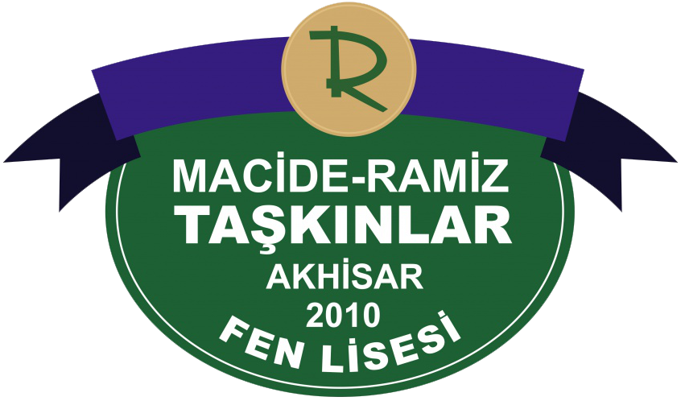

<div align="center">
  

  # AFL Mezunlar Platformu

  **A secure digital space for Akhisar Science High School alumni and students.**

  [](https://nextjs.org/)
  [](https://supabase.com/)
  [](https://workers.cloudflare.com/)
  [](https://www.typescriptlang.org/)

  [Visit the platform](https://aflmezunlar.org)
</div>

---

## Platform

AFL Mezunlar Platformu helps the school community stay connected after graduation. Verified members can keep in touch, mentor students, and share content around common interests.

### Features

- **Verified community:** Checks alumni and student signups through a controlled membership flow.
- **YKS mentorship:** Matches students with suitable alumni and tracks the mentorship process.
- **Real-time communication:** Includes direct messages, community rooms, and instant notifications.
- **Community forum:** Supports categories, tags, replies, reactions, and anonymous posts.
- **Admin tools:** Provides membership review, moderation, audit logs, and CSV-based data management.
- **Email notifications:** Handles scheduled notifications with AWS SES and Cloudflare Cron.

## Technical stack

| Layer | Technology |
| --- | --- |
| Application | Next.js 16 App Router, React 19, TypeScript |
| Interface | Tailwind CSS 4, Phosphor Icons |
| Data and auth | Supabase, PostgreSQL, Row Level Security |
| Email | AWS SES |
| Deployment | Cloudflare Workers, OpenNext |

## Local development

### Requirements

- Node.js 20 or later
- npm
- A Supabase project
- Optional AWS SES configuration for email notifications

### Setup

```bash
git clone https://github.com/ayanoglunorth/afl-mezunlar-platformu.git
cd afl-mezunlar-platformu
npm install
cp .env.example .env.local
npm run dev
```

The app runs at [http://localhost:3000](http://localhost:3000) by default.

### Environment variables

| Variable | Use |
| --- | --- |
| `NEXT_PUBLIC_SUPABASE_URL` | Supabase project URL |
| `NEXT_PUBLIC_SUPABASE_ANON_KEY` | Supabase key available to the client |
| `SUPABASE_SERVICE_ROLE_KEY` | Server-only admin operations |
| `NEXT_PUBLIC_SITE_URL` | Public app URL |
| `AWS_SES_REGION` | AWS SES region |
| `AWS_SES_ACCESS_KEY_ID` | AWS SES access key |
| `AWS_SES_SECRET_ACCESS_KEY` | AWS SES secret key |
| `EMAIL_FROM` | Sender address for notifications |
| `NOTIFICATION_CRON_SECRET` | Verification key for scheduled notification endpoints |

Never add `SUPABASE_SERVICE_ROLE_KEY`, AWS keys, or `NOTIFICATION_CRON_SECRET` to client code or Git history.

## Commands

| Command | Description |
| --- | --- |
| `npm run dev` | Starts the local development server |
| `npm run lint` | Runs ESLint |
| `npm run build` | Builds the Next.js and OpenNext production output |
| `npm run preview` | Previews the Cloudflare-compatible output locally |
| `npm run deploy` | Deploys the app to Cloudflare Workers |

## Database

Supabase schema changes and security policies are versioned under [`supabase/migrations`](supabase/migrations). When setting up a new environment, apply migration files in numeric order. Do not commit production data or local connection details.

## Contributing

Issues and improvement suggestions are welcome. For larger changes, open an issue first so the scope is clear. Pull requests should pass lint, TypeScript, and production build checks.

---

<div align="center">
  <sub>Built to keep the AFL community connected online.</sub>
</div>
